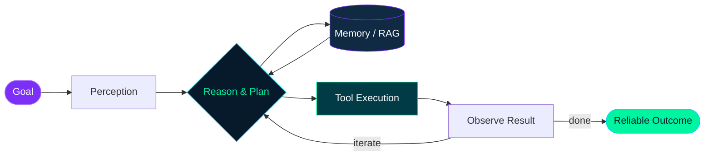

<div align="center">


<a href="https://github.com/Hans">
  
</a>

<p>
  <a href="https://github.com/Hans?tab=followers"></a>
  
  <a href="mailto:zhdydkdh@163.com"></a>
</p>

</div>

## `> whoami`

```python
class AgentBuilder:
    def __init__(self):
        self.name = "Hans"
        self.role = "AI Agent Developer"
        self.focus = [
            "LLM Agents",
            "Multi-Agent Systems",
            "Tool Use & MCP",
            "RAG & Long-term Memory",
            "Agent Evaluation & Observability",
        ]
        self.motto = "Make agents useful, reliable, and a little bit magical."

    def current_mission(self):
        return "Turning reasoning into dependable action."
```

我专注于 **Agent 系统的设计与工程落地**：让大模型不只会回答问题，还能理解目标、调用工具、协同工作，并在真实环境中稳定完成任务。

> The exciting part is not making an agent *look* intelligent — it is making one **reliably useful**.

## `> current_focus --verbose`

| Direction | What I care about |
| :--- | :--- |
| 🧠 **Agent Architecture** | Planning、Reflection、Context Engineering 与可控执行循环 |
| 🤝 **Multi-Agent Systems** | 角色分工、任务路由、协作协议与冲突消解 |
| 🔧 **Tool Use / MCP** | 可靠的工具调用、权限边界、失败恢复与人机协同 |
| 📚 **Memory & RAG** | 长短期记忆、知识检索、上下文压缩与个性化 |
| 🔬 **Evals & Observability** | 从“看起来能跑”走向可度量、可追踪、可持续优化 |



## `> tech_stack`

<div align="center">

<!-- 按你的真实技术栈增删图标：https://skillicons.dev -->


<br /><br />


</div>

## `> github_metrics --live`

<div align="center">
  
  
</div>

<div align="center">
  
</div>

<div align="center">
  
</div>

## `> connect`

<div align="center">

如果你也在探索 **Agent、LLM 应用、MCP 或多智能体系统**，欢迎交流想法、一起构建有趣的东西。

<a href="https://github.com/Hans"></a>
<a href="mailto:zhdydkdh@163.com"></a>
<!-- 可继续添加个人网站、知乎、X、LinkedIn 等链接 -->

<br /><br />


</div>
